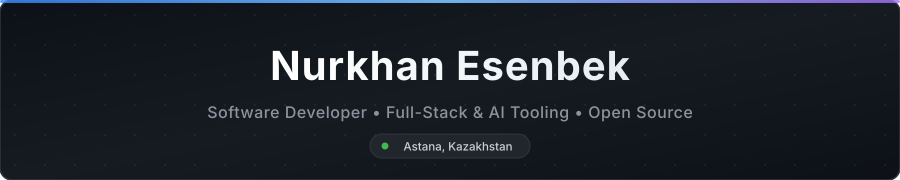

  

  
  
  

---

## About Me

I am a **Software Developer** focused on building intelligent agentic systems, scalable backend architectures, and developer productivity tools.

- **Education:** Astana IT College, Astana
- **Experience:** Software Developer Intern at [SpaceLab](https://spacelab.kz/ru) & iQadam System
- **Current Focus:** Context compilation and deterministic rule engines for AI coding agents
- **Interests:** Japanese culture, systems programming, and open-source software

---

## Featured Project

### <a href="https://github.com/kok-o/contextos-agents"> ContextOS Agents</a>

<em>Deterministic context compiler and policy engine for AI coding assistants. Prevents token overflow and enforces project engineering rules.</em>

---

## Tech Stack

**Frontend**  

 

**Backend & DevOps**  

---

## Experience

| Company | Role | Highlights |
|:---|:---|:---|
| **[SpaceLab](https://spacelab.kz/ru)** | Software Developer Intern | Backend API development, architecture integrations & team workflows |
| **iQadam System** | Software Developer Intern | Commercial software development · [Certificate](https://github.com/kok-o/kok-o/blob/main/iqadam_certificate.jpg) |

---

## Contribution Activity

<picture>
  <source media="(prefers-color-scheme: dark)" srcset="https://raw.githubusercontent.com/kok-o/kok-o/output/github-snake-dark.svg" />
  <source media="(prefers-color-scheme: light)" srcset="https://raw.githubusercontent.com/kok-o/kok-o/output/github-snake.svg" />
  
</picture>

 

### (⌐■_■)

